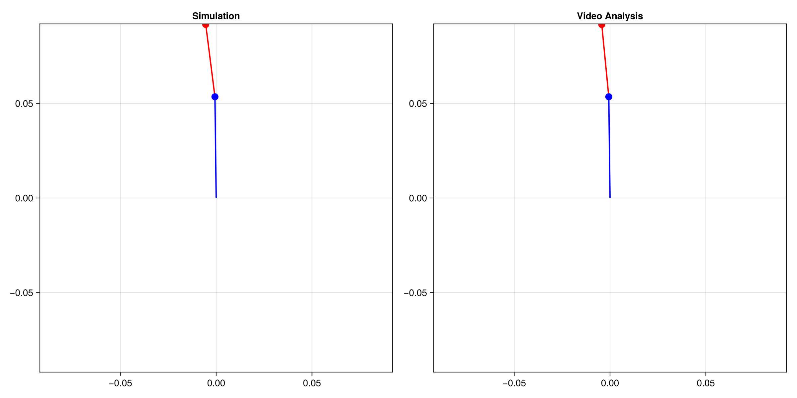
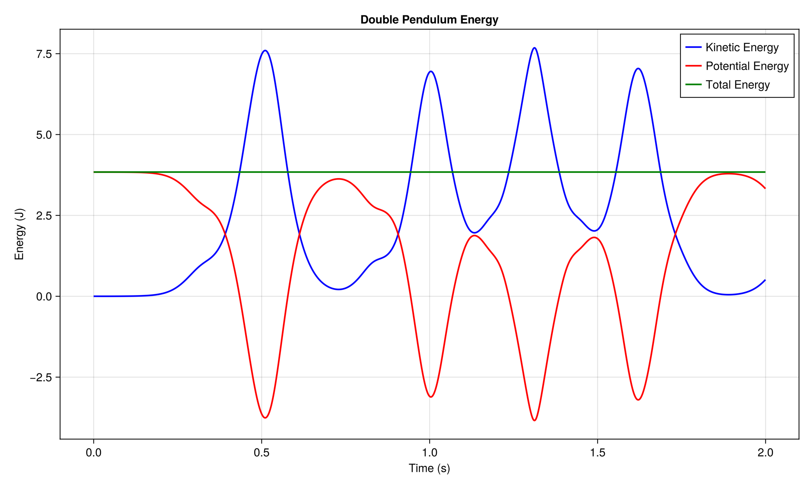
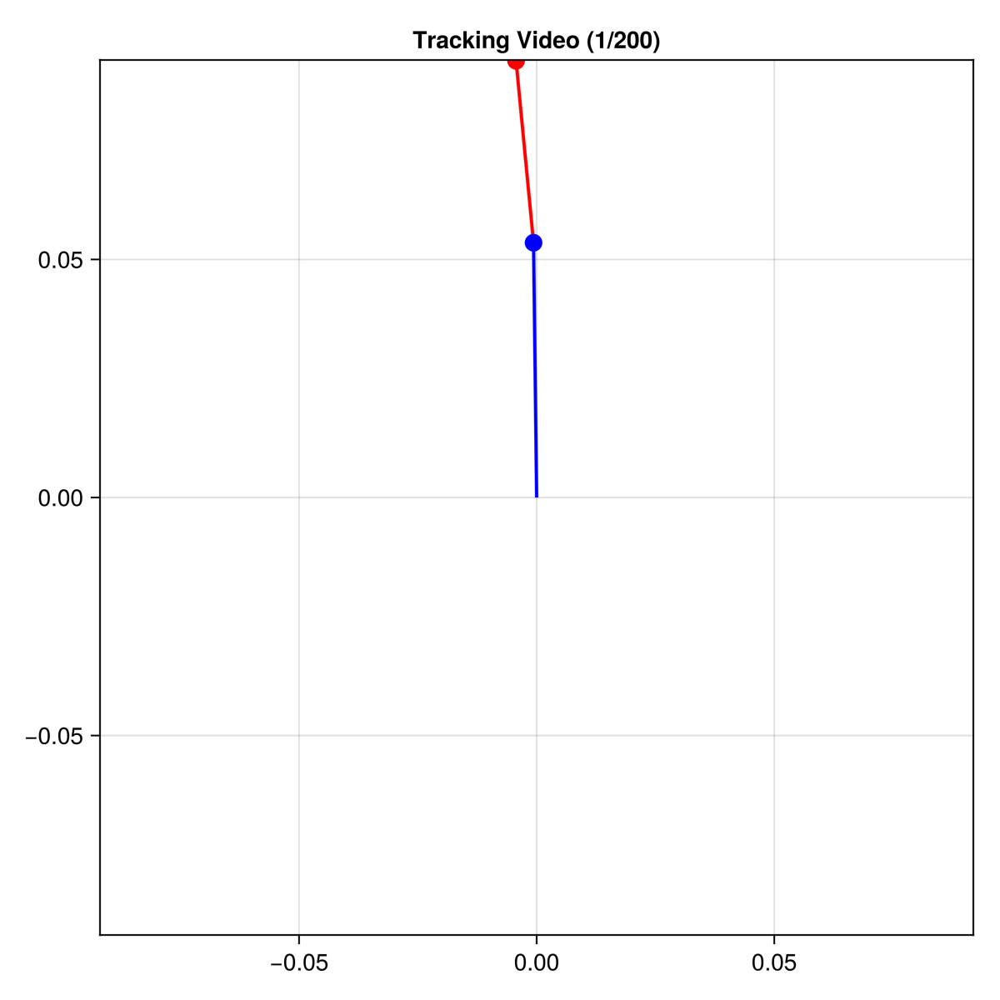

# double_pendulum
physics project that is a double pendulum simulation

## main.jl
- runs simulation and video analysis
- tries to optimize starting parameters to correspond to video
- makes a comparison gif between simulation and video
- estimates the precision of simulation with multiple scores (mse, time-accuracy, energy-deviation)
- gives a png of energy accuracy
- tries to extend the video with simulation
- makes an extension gif for video

## double_pendulum.jl
contains the physic equations, and the simulation with euler / RK4

## analysis.jl
analyses video to get the centroids of the masses, used to compare to simulation

## optimizer.jl
runs an adam-estimation to try to find m1/m2, w1_init and w2_init

## energies.jl
analyses kinetic, potential and total energy
and standard deviation

## plotters.jl
makes every plot needed

## helpers.jl
de-cluster main

## outputs

